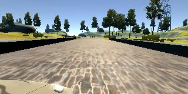

**Behavioral Cloning Project**

The goals / steps of this project are the following:
* Use the simulator to collect data of good driving behavior
* Build, a convolution neural network in Keras that predicts steering angles from images
* Train and validate the model with a training and validation set
* Test that the model successfully drives around track one without leaving the road
* Summarize the results with a written report

## Rubric Points
### Here I will consider the [rubric points](https://review.udacity.com/#!/rubrics/432/view) individually and describe how I addressed each point in my implementation.  

---
### Files Submitted & Code Quality

#### 1. Submission includes all required files and can be used to run the simulator in autonomous mode

My project includes the following files:
* model.py containing the script to create and train the model
* drive.py for driving the car in autonomous mode
* model.h5 containing a trained convolution neural network 
* writeup_report.md summarizing the results

#### 2. Submission includes functional code
Using the Udacity provided simulator and my drive.py file, the car can be driven autonomously around the track by executing 
```sh
python drive.py model.h5
```

#### 3. Submission code is usable and readable

The model.py file contains the code for training and saving the convolution neural network. The file shows the pipeline I used for training and validating the model, and it contains comments to explain how the code works.

### Model Architecture and Training Strategy

#### 1. An appropriate model architecture has been employed

The model architecture has been inspired from the Nvidia’s End to End Learning for Self-Driving Cars paper that can be found [here] (https://images.nvidia.com/content/tegra/automotive/images/2016/solutions/pdf/end-to-end-dl-using-px.pdf).


My model consists of a convolution neural network with 3x3 filter sizes and depths between 24 and 64.

By adding the cropping layer Cropping2D from Keras, the model will automatically crop the input images when making predictions.

Images have been cropped 70 pixels from top and 25 pixels from bottom.

The model includes ELU layers to introduce nonlinearity (code line 87), and the data is normalized in the model using a Keras lambda layer (code line 81). 

Flip method from the cv2 library has been used to flip the images. Images have been flipped and opposite steering measurement taken so as to generalize the model, make the car involve in appropriate right turns (code line 45).

Correction is applied to left and right camera images as we want the model to think that all the images are coming in from the same camera, hence adding correction to left cam steering measurement and subtracting from right cam steering measurement (code line 61).

The model has been trained and saved as model.h5

#### 2. Attempts to reduce overfitting in the model

The model contains dropout layers in order to reduce overfitting (model.py lines 111). 

The model was trained and validated on different data sets to ensure that the model was not overfitting. The model was tested by running it through the simulator and ensuring that the vehicle could stay on the track.

#### 3. Model parameter tuning

The model used an adam optimizer, so the learning rate was not tuned manually (model.py line 123).

##### Model Summary

Layer (type)                 Output Shape              Param #   
=================================================================
lambda_1 (Lambda)            (None, 160, 320, 3)       0         
_________________________________________________________________
cropping2d_1 (Cropping2D)    (None, 65, 320, 3)        0         
_________________________________________________________________
conv2d_1 (Conv2D)            (None, 31, 158, 24)       1824      
_________________________________________________________________
activation_1 (Activation)    (None, 31, 158, 24)       0         
_________________________________________________________________
conv2d_2 (Conv2D)            (None, 14, 77, 36)        21636     
_________________________________________________________________
activation_2 (Activation)    (None, 14, 77, 36)        0         
_________________________________________________________________
conv2d_3 (Conv2D)            (None, 5, 37, 48)         43248     
_________________________________________________________________
activation_3 (Activation)    (None, 5, 37, 48)         0         
_________________________________________________________________
conv2d_4 (Conv2D)            (None, 3, 35, 64)         27712     
_________________________________________________________________
activation_4 (Activation)    (None, 3, 35, 64)         0         
_________________________________________________________________
conv2d_5 (Conv2D)            (None, 1, 33, 64)         36928     
_________________________________________________________________
activation_5 (Activation)    (None, 1, 33, 64)         0         
_________________________________________________________________
flatten_1 (Flatten)          (None, 2112)              0         
_________________________________________________________________
dense_1 (Dense)              (None, 100)               211300    
_________________________________________________________________
activation_6 (Activation)    (None, 100)               0         
_________________________________________________________________
dropout_1 (Dropout)          (None, 100)               0         
_________________________________________________________________
dense_2 (Dense)              (None, 50)                5050      
_________________________________________________________________
activation_7 (Activation)    (None, 50)                0         
_________________________________________________________________
dense_3 (Dense)              (None, 10)                510       
_________________________________________________________________
activation_8 (Activation)    (None, 10)                0         
_________________________________________________________________
dense_4 (Dense)              (None, 1)                 11        
=================================================================
Total params: 348,219
Trainable params: 348,219
Non-trainable params: 0
_________________________________________________________________

#### 4. Appropriate training data

Training data was chosen to keep the vehicle driving on the road. I used a combination of center lane driving and driving in opposite direction.

Data was recorded based on following startegy:
1. Center driving on 1st track - 2 laps 
2. Center driving on 1st track (opposite direction) - 2 laps
3. Center driving on 2nd track - 1 lap
4. Recovery driving from both sides - 1 lap

Images were recorded and stored in IMG folder. Below are the sample images from the dataset that are used to train the model.




#### 5. Simulation

The car has been driven in autonomous mode using the drive.py file and passing the model.h5 as argument to
it.

A video has been saved of the output as video.mp4 (video.gif has been created) using the drive.py file by passing another argument which is directory of the images to be saved and these images are converted to a video using video.py provided by Udacity. ( Speed has been chaged to 20 from default 9 in drive.py )